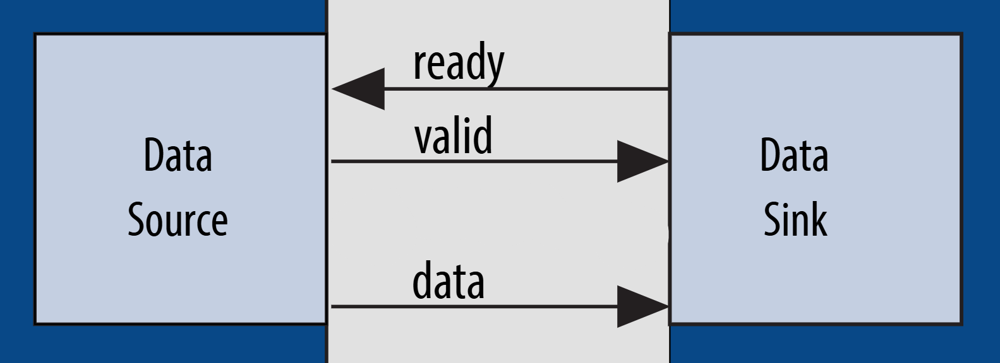
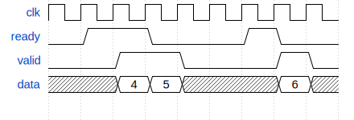

# Protocolo Avalon Streaming

Padronizar interfaces de comunicação é muito importante para que dispositivos diferentes consigam se comunicar entre si. Afinal, se cada um se comunicar com sinais e tempos diferentes, não haverá nenhuma comunicação! Neste laboratório iremos implementar uma interface simples de comunicação chamada [Avalon Streaming](https://www.intel.com/content/www/us/en/docs/programmable/683364/18-1/streaming-interfaces.html), mantida pela Intel FPGA e aberta para o uso geral. Essa interface geralmente é utilizada para transmitir dados num formato de fluxo (stream) da maneira mais rápida e simples possível.

## Sinais da interface

A interface, como se pode ver na especificação do link anterior, possui vários sinais. A boa notícia é que a maioria deles é opcional, e podemos reduzir os sinais aos seguintes:

Ponto de vista do Produtor de dados (Data Source):

| Sinal            | Descrição    |
|------------------|--------------|
| Valid (Saída)    | Avisa o consumidor de dados que os dados na porta de dados estão válidos. Só pode ficar em nível alto se o sinal `ready` estiver alto ou no ciclo seguinte ao que `ready` baixar.|
| Ready (Entrada)  | Aviso vindo do consumidor de dados de que ele está pronto para receber os dados. Ativo em nível alto.|
| Data (Saída)     | Dados a serem transmitidos. Só pode ocorrer transmissão quando tanto o sinal de `valid` quanto o de `ready` estiverem em nível alto. *Permite atraso de um ciclo*.|

Outra maneira de enxergar os sinais é pela ilustração abaixo, retirada da especificação.

## Máquina de estados a ser projetada

A máquina de estados finita a ser projetada deve ser de Moore, ou seja, a saída depende apenas do estado e a mudança de estados depende da entrada.
A máquina deve implementar a interface avalon streaming e transmitir dados por ela. **Os dados a serem transmitidos são 4, 5 e 6**

O diagrama temporal mostrando como os sinais da máquina devem se comportar aparece abaixo.

Note que:
- O `valid` sobe um ciclo de relógio depois de `ready`, respeitando a máquina de Moore;
- Os dados são transmitidos ou quando ambos os sinais estão em nível alto ou um ciclo depois de `ready` baixar (desde que `valid` se mantenha alto neste último ciclo);
- É necessário colocar `valid` em nível alto e entregar o dado toda vez que `ready` ficar em nível alto;
- A linha de dados em cinza significa que pode assumir qualquer valor que não será considerado (don't care).

## Execução da atividade

Siga o modelo de módulo já fornecido e utilize o testbench e scripts de execução para sua verificação. Em seguida, implemente o circuito de acordo com as especificações e, se necessário, crie outros testes para verificá-lo.

Uma vez que estiver satisfeito com o seu código, execute o script de testes com `./run-all.sh`. Ele mostrará na tela `ERRO` em caso de falha ou `OK` em caso de sucesso.

> **Dica:** Use o mostrador de forma de onda GTKWave para ajudar na depuração

> **Dica:** Após usar `iverilog -o tb *.v`, use o comando `vvp tb` para ver as mensagens de erro da simulação. Este TestBench avisa os erros que aparecerem durante a execução.

## Entrega

Realize um *commit* no repositório do **GitHub Classroom**. O sistema de correção automática vai validar sua implementação e atribuir uma nota com base nos testes.

> **Dica:**  Não modifique os arquivos de correção! Para entender como os testes funcionam, consulte o script `run.sh` disponível no repositório.